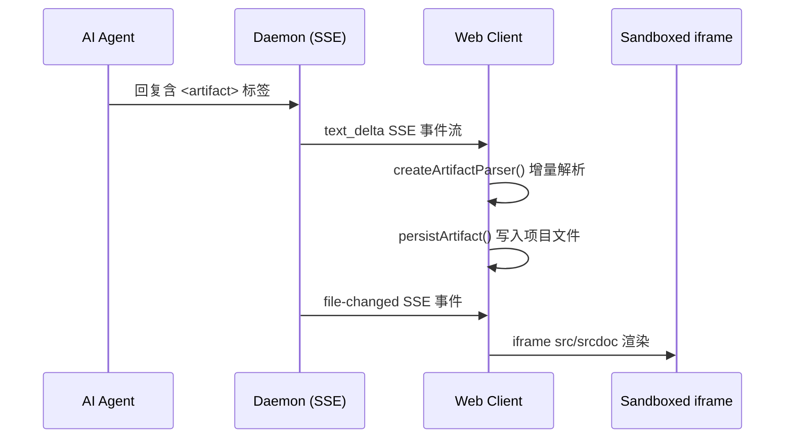

# Preview 渲染体系架构详解

> 本文梳理 Open Design 中生成代码的预览渲染全流程：agent 产出 `<artifact>` 标签 →
> daemon SSE 流式推送 → web 端增量解析 → iframe 沙箱渲染。涵盖 HTML/React/SVG/Markdown/Deck
> 五种渲染器、安全隔离机制、Live Reload 与 Live Artifact 子系统。

## 整体流程概览



## 阶段 1：Agent 产出 `<artifact>` 标签

AI agent 的回复中嵌入结构化的 artifact 块：

```html
<artifact identifier="my-app" type="text/html" title="示例应用">
  <!DOCTYPE html>
  <html>...</html>
</artifact>
```

系统 prompt 中对 artifact 格式的定义位于 `packages/contracts/src/prompts/official-system.ts:35-46`。

## 阶段 2：Daemon SSE 流式推送

Daemon 将 agent 输出作为 `text_delta` SSE 事件逐块推送给 Web 客户端。SSE 协议类型定义：

- 事件类型联合：`packages/contracts/src/sse/chat.ts:41-69`
- 包含 `text_delta`、`artifact`、`tool_use` 等事件类型

## 阶段 3：Web 端增量解析 artifact

### 流式解析器

`apps/web/src/artifacts/parser.ts:89-179` 中的 `createArtifactParser()` 是一个 generator 函数，接收 text delta 文本块，yield 三种事件：

- `artifact:start` — 解析到 `<artifact>` 开标签，提取 `identifier`、`type`、`title` 属性
- `artifact:chunk` — 积累 artifact 内容片段
- `artifact:end` — 解析到 `</artifact>` 闭标签

### ProjectView 接线

`apps/web/src/components/ProjectView.tsx:921-1016` 中每轮对话实例化 parser：

- `applyContentDelta` 方法将 SSE delta 喂入 parser
- 解析结果更新 `artifact` React state，触发实时预览

### Artifact Manifest

每个 artifact 会生成一个 JSON sidecar 文件（`<filename>.artifact.json`），记录 artifact 的元信息（type、title、identifier 等）。Manifest 创建逻辑位于 `apps/web/src/artifacts/manifest.ts`。

## 阶段 4：Artifact 持久化

`apps/web/src/components/ProjectView.tsx:1187-1243` 中的 `persistArtifact` 在流结束后：

1. 通过 `writeProjectTextFile()` 将 HTML 写入项目文件树
2. 生成 `ArtifactManifest` JSON sidecar
3. 文件出现在文件列表后自动打开为 tab

Daemon 侧也提供 artifact 保存 API：

- `POST /api/artifacts/save`（`apps/daemon/src/server.ts:2089-2110`）：持久化到 `.od/artifacts/<timestamp>-<slug>/index.html`，并执行 anti-slop linter
- `POST /api/artifacts/lint`（`apps/daemon/src/server.ts:2115-2129`）：检查 HTML 质量问题（如 `scrollIntoView` 会破坏 iframe 预览）

## 阶段 5：iframe 渲染预览

核心渲染组件为 **FileViewer**（`apps/web/src/components/FileViewer.tsx`，约 3281 行）。

### 两种 iframe 策略

渲染模式决策逻辑位于 `apps/web/src/components/file-viewer-render-mode.ts:1-61`：

| 策略 | iframe 属性 | 使用场景 |
|------|-------------|----------|
| **URL-load** | `src="/api/projects/:id/raw/:file?v=${mtime}"` | 默认 HTML 预览；浏览器逐资源请求，支持 DevTools 和 source map |
| **srcDoc inline** | `srcDoc={buildSrcdoc(...)}` | Deck 模式（需 deck bridge）、评论模式（需 comment bridge）、`?forceInline=1` |

两种策略均使用 `sandbox="allow-scripts"`（**不含** `allow-same-origin`），赋予 iframe opaque origin。

### 渲染器注册表

`apps/web/src/artifacts/renderer-registry.ts:1-108` 按文件类型分发到不同渲染器：

| 渲染器 | 文件类型 | 实现方式 |
|--------|----------|----------|
| `HtmlRenderer` | `.html` | 直接 iframe 加载 |
| `ReactComponentRenderer` | `.jsx`/`.tsx` | 浏览器端 Babel 编译 + eval |
| `MarkdownRenderer` | `.md` | Markdown 渲染 |
| `SvgRenderer` | `.svg` | SVG 渲染 |
| `DeckHtmlRenderer` | 幻灯片 HTML | 注入 deck bridge 脚本 |

### React 组件预览（浏览器端编译）

`apps/web/src/runtime/react-component.ts:1-231` 实现了完全在浏览器端的 JSX/TSX 编译流水线：

1. 剥离 import 声明，将 React 引用重写到 `window.React`
2. 剥离/转换 export 声明，捕获 default export 名称
3. 通过 Babel Standalone（CDN 加载）以 `['typescript', 'react']` preset 编译
4. 在沙箱 iframe 内 `eval()` 编译结果
5. 查找组件：`window.__OpenDesignComponent` > `App` > `Component` > `Preview`
6. 使用 `ReactDOM.createRoot(root).render(React.createElement(Component))` 渲染

**无服务端打包**——完全客户端编译。

### Deck（幻灯片）预览

`apps/web/src/runtime/srcdoc.ts:214-501` 中 `injectDeckBridge()` 支持三种 deck 约定：

1. **水平滚动 deck** — 基于 scroll 的导航
2. **Class toggle deck** — `.active`/`.is-active`/`.current` 类名切换
3. **Visibility-only deck** — `display:none` 切换

宿主与 iframe 通过 `postMessage` 通信：

- 宿主 → iframe：`{type: 'od:slide', action: 'next'|'prev'|...}`
- iframe → 宿主：`{type: 'od:slide-state', active: N, count: N}`

## 安全隔离机制

### iframe 沙箱

所有预览 iframe 使用 `sandbox="allow-scripts"`，省略 `allow-same-origin`：

- 生成代码获得 opaque origin，无法访问宿主页面的 cookies、storage、DOM
- 配置位于 `apps/web/src/components/FileViewer.tsx:2455,2464`

### localStorage 内存 shim

由于省略 `allow-same-origin`，`localStorage`/`sessionStorage` 访问会抛 `SecurityError`。`apps/web/src/runtime/srcdoc.ts:66-104` 在用户脚本执行前注入内存 shim，防止崩溃。

### 新标签页沙箱

`apps/web/src/runtime/exports.ts:169-194` 中 `buildSandboxedPreviewDocument()` 创建双层 iframe 包裹：外层 HTML 页面内嵌 `<iframe sandbox="allow-scripts" srcdoc="...">`，确保新标签页中生成代码仍然被隔离。

### CORS 支持

Daemon 的 `/api/projects/:id/raw/*` 路由（`apps/daemon/src/server.ts:2741-2747`）允许 `Origin: null`（来自沙箱 iframe 的请求），响应 `Access-Control-Allow-Origin: *`。

## Live Reload

Daemon 使用 chokidar 监听项目目录文件变化（`apps/daemon/src/server.ts:1494-1537`）：

1. 文件变更时发送 `file-changed` SSE 事件
2. Web 端更新文件列表中的 `mtime`
3. iframe 通过 `?v=${mtime}` query param 实现缓存失效刷新

## Live Artifact（数据驱动仪表盘）

独立于普通 artifact 的子系统，支持模板 + 数据分离的可刷新仪表盘。

### 数据模型

类型定义：`packages/contracts/src/api/live-artifacts.ts`

```typescript
interface LiveArtifact {
  document: {
    templatePath: 'template.html';  // Mustache 模板
    dataPath: 'data.json';          // 数据源
    generatedPreviewPath: 'index.html'; // 渲染结果
  };
}
```

### 模板渲染

`apps/daemon/src/live-artifacts/render.ts` 中 `renderHtmlTemplateV1()` 实现 Mustache 风格的 `{{ data.field }}` 插值，带 HTML 转义。安全验证（`render.ts:20-27`）禁止模板中包含：

- `<script>` 标签
- `<iframe>` 标签
- 事件处理器属性

### API 端点

- `GET /api/live-artifacts/:artifactId/preview?projectId=...`（`server.ts:2152`）：提供渲染后的 HTML
- SSE 事件 `live_artifact` 和 `live_artifact_refresh` 通知客户端变更

## 关键文件索引

| 文件 | 职责 |
|------|------|
| `apps/web/src/artifacts/parser.ts` | 流式 `<artifact>` 标签解析器 |
| `apps/web/src/artifacts/manifest.ts` | Artifact manifest 创建/解析 |
| `apps/web/src/artifacts/renderer-registry.ts` | 文件类型 → 渲染器分发 |
| `apps/web/src/runtime/srcdoc.ts` | 构建沙箱 iframe srcdoc（含 shim 和 bridge） |
| `apps/web/src/runtime/react-component.ts` | 浏览器端 JSX/TSX 编译 |
| `apps/web/src/runtime/exports.ts` | 导出功能（HTML、ZIP、PDF、新标签页） |
| `apps/web/src/components/FileViewer.tsx` | 主预览组件（iframe 渲染） |
| `apps/web/src/components/ProjectView.tsx` | 聊天 + artifact 流编排 |
| `apps/web/src/components/file-viewer-render-mode.ts` | URL-load vs srcDoc 决策 |
| `apps/daemon/src/server.ts:2737` | 原始文件服务（iframe URL-load 目标） |
| `apps/daemon/src/server.ts:2089` | Artifact 持久化到磁盘 |
| `apps/daemon/src/server.ts:1494` | 文件监听 SSE（Live Reload） |
| `apps/daemon/src/live-artifacts/render.ts` | Live Artifact 模板渲染 |
| `packages/contracts/src/api/artifacts.ts` | Artifact 类型定义 |
| `packages/contracts/src/api/live-artifacts.ts` | Live Artifact 类型定义 |
| `packages/contracts/src/sse/chat.ts` | SSE 事件协议类型 |
