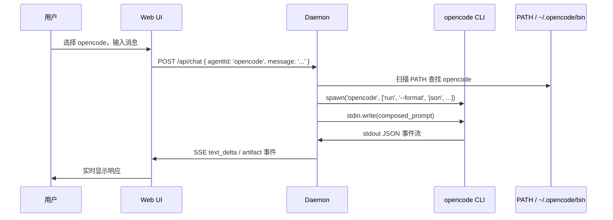

# Local CLI Agent 连接架构详解

> 本文梳理 Open Design 中本地 CLI agent 的完整连接流程：从用户选择 agent 到
> 浏览器收到流式响应。涵盖 PATH 扫描检测、/api/chat 请求处理、子进程 spawn、stdin prompt
> 注入与 JSON 事件流解析。以 opencode 为例说明。

## 整体流程概览



## 阶段 1：Agent 定义

每个支持的本地 CLI agent 在 `apps/daemon/src/agents.ts` 中有对应配置。opencode 定义（`agents.ts:321-359`）：

```typescript
{
  id: 'opencode',
  name: 'OpenCode',
  bin: 'opencode',                    // PATH 扫描用的二进制名
  versionArgs: ['--version'],
  listModels: {
    args: ['models'],
    parse: parseLineSeparatedModels,
    timeoutMs: 8000,
  },
  buildArgs: (_prompt, _imagePaths, _extra, options = {}) => [
    'run',
    '--format', 'json',
    '--dangerously-skip-permissions',
    ...(options.model ? ['--model', options.model] : []),
    '-',                          // stdin 哨兵
  ],
  promptViaStdin: true,            // 避免命令行过长
  streamFormat: 'json-event-stream',
  eventParser: 'opencode',        // 专用 JSON 事件解析器
}
```

关键配置项：

| 配置项 | 作用 |
|--------|------|
| `bin` | PATH 扫描的二进制名 |
| `buildArgs` | 构建 CLI 参数，'-' 表示 stdin 哨兵 |
| `promptViaStdin` | 通过 stdin 传递 prompt，避免 argv 长度限制 |
| `streamFormat` | stdout 输出格式（json-event-stream） |
| `eventParser` | 事件解析器名称（'opencode' 对应专用解析器） |

## 阶段 2：PATH 扫描检测

Daemon 启动时调用 `detectAgents()`（`apps/daemon/src/agents.ts:921-930`）：

```typescript
export async function detectAgents() {
  const results = await Promise.all(AGENT_DEFS.map(probe));
  for (const agent of results) {
    rememberLiveModels(agent.id, agent.models);
  }
  return results;
}
```

`probe()` 函数的检测逻辑：

1. **解析二进制路径** → `resolveAgentBin(agentId)`，依次检查：
   - 系统 PATH（`which` / `command -v`）
   - 额外路径：`~/.opencode/bin`（`agents.ts:751`）
2. **版本检测** → 执行 `opencode --version`
3. **模型列表** → 执行 `opencode models`（可选，失败则使用 fallback）

检测结果通过 `/api/agents` API 暴露给 Web 端。

## 阶段 3：API 入口

Web 端发送聊天请求到 `POST /api/chat`（`apps/daemon/src/server.ts:3899-3903`）���

```typescript
app.post('/api/chat', (req, res) => {
  const run = design.runs.create();
  design.runs.stream(run, req, res);
  design.runs.start(run, () => startChatRun(req.body || {}, run));
});
```

请求体包含：
- `agentId`: 'opencode'
- `message`: 用户消息
- `model`: 用户选择的模型（可选）
- `projectId`: 项目 ID（可选）

## 阶段 4：startChatRun 处理

`apps/daemon/src/server.ts:3276-3694` 中 `startChatRun` 函数完成核心编排：

### 4.1 获取 Agent 定义

```typescript
const def = getAgentDef(agentId);
if (!def) return error('AGENT_UNAVAILABLE', `unknown agent: ${agentId}`);
```

### 4.2 解析模型

```typescript
const safeModel = typeof model === 'string'
  ? isKnownModel(def, model) ? model : sanitizeCustomModel(model)
  : null;
```

### 4.3 构建 Prompt

```typescript
const composed = [
  `# Instructions\n\n${instructionPrompt}`,
  `# User request\n\n${message}`,
  safeImages.length ? `@${imagePaths.join(' ')}` : '',
].join('');
```

### 4.4 promptBudget 检查

`checkPromptArgvBudget()` 检查 prompt 是否超过 CLI argv 长度限制。如果使用 `promptViaStdin: true`，则通过 stdin 传递，跳过此检查。

### 4.5 解析二进制路径

```typescript
const resolvedBin = resolveAgentBin(agentId);
if (!resolvedBin) {
  return error('AGENT_UNAVAILABLE', `Agent "${def.name}" not on PATH`);
}
```

## 阶段 5：子进程 Spawn

`apps/daemon/src/server.ts:3655-3694`：

```typescript
const env = {
  ...spawnEnvForAgent(def.id, ...),
  OD_DAEMON_URL: daemonUrl,
  OD_PROJECT_ID: projectId,
  // ...
};

child = spawn(resolvedBin, args, {
  env,
  stdio: ['pipe', 'pipe', 'pipe'],  // stdin/stdout/stderr 都管道化
  cwd: effectiveCwd,
  shell: false,
});

// 通过 stdin 发送 prompt
if (def.promptViaStdin && child.stdin) {
  child.stdin.write(composed);
  child.stdin.end();
}
```

stdin 模式选择逻辑（`server.ts:3658-3663`）：

```typescript
const stdinMode = def.promptViaStdin || def.streamFormat === 'acp-json-rpc'
  ? 'pipe'       // 通过管道传递 prompt
  : 'ignore';   // 忽略 stdin，prompt 通过 argv 传递
```

## 阶段 6：JSON 事件流解析

子进程 stdout 输出的 JSON 事件被流式解析：

`apps/daemon/src/json-event-stream.ts:304` 中 `handleOpenCodeEvent()` 专用解析器：

```typescript
if (kind === 'opencode' && handleOpenCodeEvent(obj, onEvent, state)) return;
```

解析过程：
1. 逐行读取 stdout
2. 解析 JSON 对象
3. 转换为 SSE 事件
4. 通过 `design.runs.emit(run, event, data)` 发送到客户端

常见事件类型：
- `text_delta`: 文本增量
- `artifact_start` / `artifact_chunk` / `artifact_end`: artifact 块
- `tool_use`: 工具调用
- `error`: 错误

## 阶段 7：浏览器接收

Web 端 SSE 流消费（`apps/web/src/components/ProjectView.tsx:921-1016`）：
- `applyContentDelta()` 处理 `text_delta` 事件
- `createArtifactParser()` 增量解析 artifact 标签
- 实时更新 UI

## 关键文件索引

| 文件 | 职责 |
|------|------|
| `apps/daemon/src/agents.ts:321-359` | opencode 适配器定义 |
| `apps/daemon/src/agents.ts:921-930` | `detectAgents()` PATH 扫描入口 |
| `apps/daemon/src/agents.ts:751` | 额外 PATH：`~/.opencode/bin` |
| `apps/daemon/src/server.ts:3899-3903` | `/api/chat` 入口 |
| `apps/daemon/src/server.ts:3276-3694` | `startChatRun` 核心编排 |
| `apps/daemon/src/server.ts:3655-3694` | CLI spawn 与 stdin 注入 |
| `apps/daemon/src/json-event-stream.ts:304` | opencode JSON 事件解析器 |
| `apps/web/src/components/ProjectView.tsx` | 浏览器端 SSE 消费 |